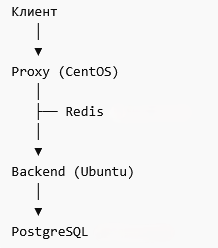

# Тестовое приложение с кеширующим слоем

## Логика работы

Внешние пользователи (клиенты) обращаются в **прокси**.   
Прокси проверяет наличие запрашиваемых данных в **Redis**:
 - если данные найдены – сразу возвращает их клиенту;
 - если данных нет – прокси запрашивает их у **Backend API**, которое ходит в **PostgreSQL** и возвращает результат, затем прокси сохраняет данные в **Redis** и отдаёт клиенту.

## Архитектура

**VM1 (Ubuntu)**: Backend API + PostgreSQL 15+  
**VM2 (CentOS)**: Proxy API + Redis 7+

## Схема взаимодействия

## Структура репозитория

- **assets/** - доп. файлы для проекта;  
- **backend/** - исходники для сборки .deb пакета для Backend API (включая systemd-юнит и control-файл);  
- **db/** - скрипт инициализации БД и CSV-файл для заполнения таблицы;  
- **docs/** - документация проекта (ТЗ, инструкции по развертыванию и сборке пакетов, отчет);  
- **packages/** - собранные пакеты .deb и .rpm;  
- **proxy/** - исходники для сборки .rpm пакета для Cache API (включая systemd-юнит и spec-файл);  
- **scripts/** - скрипты *rules.sh для настройки сетевого взаимодействия.  

## Документация и отчет

- [Инструкция по сборке .deb и .rpm пакетов](docs/package_build.md)
- [Инструкция по развертыванию приложения](docs/deployment_guide.md)
- [Отчет со скриншотами работающих сервисов, curl-запросами и логами](docs/report.md)