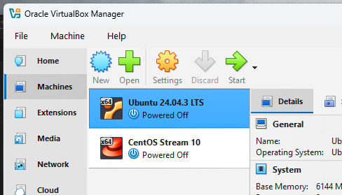

1. **Разворачивание ВМ** 

В VirtualBox развернуты 2 ВМ с сетевым адаптером Bridged:  
- для Backend API + PostgreSQL - Ubuntu 24.04.3 LTS (IP 192.168.0.177)
- для прокси + Redis - CentOS Stream 10 (IP 192.168.0.117)



2. **Установка PostgreSQL на VM1 (Ubuntu)**  

```bash
sudo apt update
sudo apt install postgresql postgresql-contrib
sudo systemctl start postgresql
sudo systemctl enable postgresql
```

Редактируем **/etc/hosts**, добавляем запись:

```
127.0.0.1 postgres
```

3. **Установка Redis на VM2 (CentOS), используется форк Valkey 8.0.6**  

```bash
sudo dnf update  
sudo dnf install valkey  
sudo systemctl start valkey  
sudo systemctl enable valkey
```

Редактируем **/etc/hosts**, добавляем записи (для backend-api использовать фактический IP-адрес ВМ, на котором хостится бэкенд):  

```
127.0.0.1 valkey 
192.168.0.177 backend-api
```

4. **Клонирование Git-репозитория на виртуальные машины VM1 и VM2**

```bash
git clone https://github.com/Chaotica-Rei/dapp.git
```

5. **Запуск создания пользователя testuser, БД test и таблицы users в PostgreSQL на VM1**

```bash
cd dapp/db
psql -U postgres -f init.sql
```

6. **Настройка сетевого взаимодействия**

На VM1:

```bash
cd dapp/scripts
sudo chmod +x ubuntu-rules.sh
sudo ./ubuntu-rules.sh
```

на VM2:

```bash
cd dapp/scripts
sudo chmod +x centos-rules.sh
sudo ./centos-rules.sh  
```

7. **Установка пакетов**

На VM1:

```bash
cd dapp/packages  
sudo dpkg -i backend-api_1.0.0_amd64.deb  
```
Проверка статуса сервиса и журнал:

```bash
sudo systemctl status backend-api.service  
sudo journalctl -u backend-api.service -f
```

На VM2:

```bash
cd dapp/packages
sudo dnf install cache-api-1.0-1.el10.noarch.rpm
```

Запуск сервиса и проверка статуса:

```bash
sudo systemctl enable cache-api  
sudo systemctl start cache-api
sudo systemctl status cache-api
```