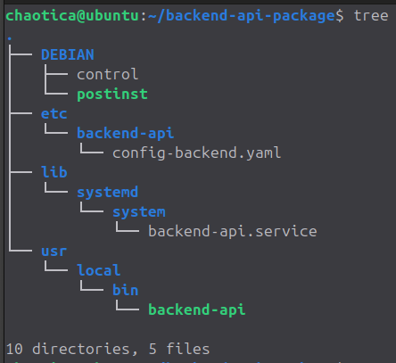
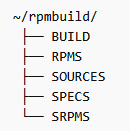

## Инструкция по сборке .deb пакета для Backend API и .rpm пакета для Proxy API

### 1. Сборка .deb пакета для Backend API

Готовим структуру для сборки:

```bash
sudo mkdir backend-api-package
cd backend-api-package
sudo mkdir -p \
  DEBIAN \
  etc/backend-api \
  lib/systemd/system \
  usr/local/bin
```
Создаем GO-бинарник, в директории с исходником [backend-api.go](../backend/backend-api.go) выполняем:

```bash
go mod init backend-api
go mod tidy
GOOS=linux GOARCH=amd64 go build -o backend-api backend-api.go
```

После выполнения команды:

- созданный бинарник перемещаем в директорию *backend-api-package/usr/local/bin/*;
- конфиг [config-backend.yaml](../backend/config-backend.yaml) перемещаем в директорию *backend-api-package/etc/backend-api/*;
- systemd-юнит [backend-api.service](../backend/backend-api.service) перемещаем в директорию *backend-api-package/lib/systemd/system/*; 
- файл [control](../backend/control) перемещаем в директорию *backend-api-package/DEBIAN/*;
- файл [postinst](../backend/postinst) перемещаем в директорию *backend-api-package/DEBIAN/* и делаем его исполняемым `sudo chmod +x postinst`.

В итоге должна получиться следующая структура каталогов и файлов:



Настраиваем права:

```bash
sudo chmod 755 backend-api-package/usr/local/bin/backend-api
sudo chmod 644 backend-api-package/etc/backend-api/config-backend.yaml
sudo chmod 644 backend-api-package/lib/systemd/system/backend-api.service
sudo chmod 755 backend-api-package/DEBIAN/postinst
```

Запускаем сборку пакета в корне директории *backend-api-package/*:

```bash
sudo dpkg-deb --build . ../backend-api_1.0.0_amd64.deb
```

#### 2. Сборка .rpm пакета для Proxy API

Устанавливаем инструменты для сборки:

```bash
sudo dnf update
sudo dnf install rpm-build rpmdevtools
```

Создаем структуру:

```bash
rpmdeb-setuptree
```

Создастся следующая структура каталогов:



Создаем директорию для исходников:

```bash
sudo mkdir cache-api-1.0
```

В созданную директорию размещаем:

- исходник [cache-api.py](../proxy/cache-api.py) прокси приложения;
- конфиг [config-api.yaml](../proxy/config-api.yaml);
- файл зависимостей [requirements.txt](../proxy/requirements.txt);
- systemd-юнит [cache-api.service](../proxy/cache-api.service).

 Создаем архив на основе исходников и перемещаем его в директорию *~/rpmbuild/SOURCES/*:

```bash
sudo tar czf cache-api-1.0.tar.gz cache-api-1.0
sudo mv cache-api-1.0.tar.gz ~/rpmbuild/SOURCES
```

В директорию *~/rpmbuild/SPECS/* размещаем spec-файл [cache-api.spec](../proxy/cache-api.spec)

Запускаем сборку пакета:

```bash
rpmbuild -ba ~/rpmbuild/SPECS/cache-api.spec
```

Собранный пакет появится в директории *~/rpmbuild/RPMS/noarch/*