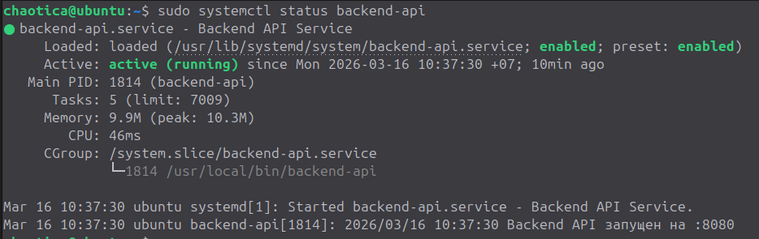
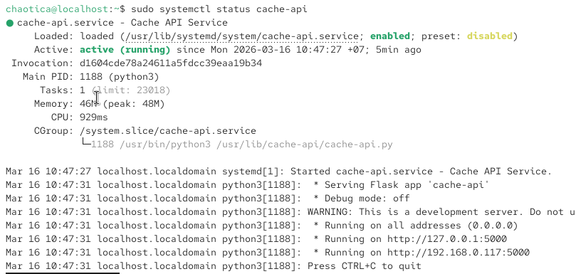
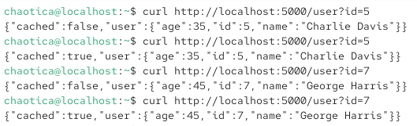
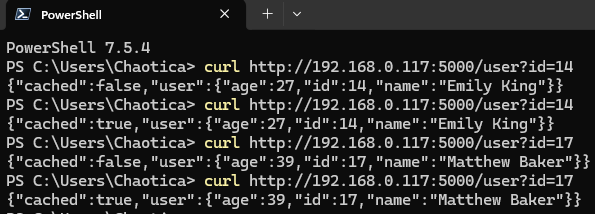
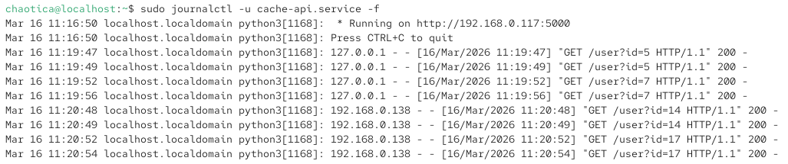

## Работающие сервисы в systemctl 

Для Backend:

Для Proxy:

## Curl-запросы и логи

Выполняем запросы к прокси локально:

Выполняем запросы к прокси от другого источника (например, хостовая ОС с IP 192.168.0.138):

Смотри логи, видим запросы к прокси, выполненные локально и от другой машины с адресом 192.168.0.138:

